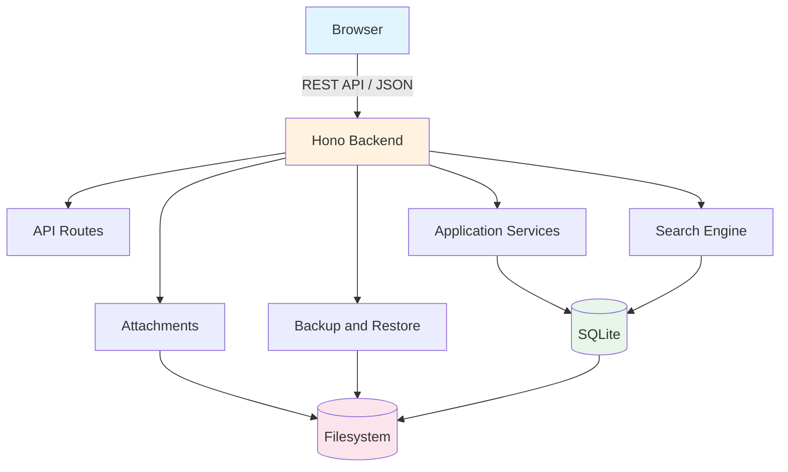

# Architecture

This document describes the architectural approach for RTWiki. It defines the modular monolith structure, the boundaries between layers, the data flow, and the key design principles that guide implementation.

## 1. Architectural Style

RTWiki follows a **simple modular monolith** pattern. There is a single application process that serves both the backend API and the frontend web UI. The application is designed so that, if needed in a future phase, individual modules could be extracted without a complete rewrite. No microservices, no message queues, and no distributed transactions are introduced in the MVP.

## 2. High-Level Component Diagram

## 3. Layer Boundaries

Each layer has a single responsibility and communicates only with its adjacent layers.

### 3.1 Web UI (Frontend)

- **Technology:** React + TypeScript, Vite, Mantine UI, Tabler Icons React
- **Responsibility:** Render the application shell, navigation, and editor. Handle user interactions and display data from the API.
- **Inputs:** REST API responses (JSON).
- **Outputs:** User actions (create, update, delete, search, upload).
- **Constraints:** No server-side rendering. No direct database access. All API calls go through a single typed client module.
- **Version policy:** The React version will be selected and pinned during the implementation phase to be compatible with the selected stable BlockNote, Mantine, and Vite versions. Major versions must never float. Compatibility takes priority over selecting the newest version.

### 3.2 Editor

- **Technology:** BlockNote with `@blocknote/math-block` and `@blocknote/diagram-block`
- **Responsibility:** Provide the block-based editing experience. Manage block state locally and sync to the API via debounced autosave.
- **Scope:** One editor instance per active page. Editor instances are **not** global singletons.
- **Lazy loading:** `@blocknote/math-block` and `@blocknote/diagram-block` are lazy-loaded to reduce initial bundle size.

### 3.3 API Routes

- **Technology:** Hono routes
- **Responsibility:** Expose RESTful endpoints for pages, attachments, search, and backups. Validate all incoming requests using schema validators (e.g., Zod).
- **Endpoints:**
  - `GET /api/pages` — list pages
  - `POST /api/pages` — create page
  - `GET /api/pages/:id` — get page by ID
  - `PATCH /api/pages/:id` — update page
  - `DELETE /api/pages/:id` — soft-delete page
  - `GET /api/pages/:id/attachments` — list attachments
  - `POST /api/pages/:id/attachments` — upload attachment
  - `GET /api/search?q=...` — full-text search
  - `POST /api/backup/create` — create backup archive
  - `POST /api/backup/restore` — restore from archive
- **Constraint:** Every route validates inputs. No raw user input reaches the database.

### 3.4 Application Services

- **Responsibility:** Implement business logic. Services are pure functions or classes that operate on validated data.
- **Examples:**
  - `PageService` — CRUD operations, tag management, link resolution
  - `SearchService` — FTS5 query execution and result formatting
  - `AttachmentService` — upload, validation, storage, and retrieval
  - `BackupService` — archive creation and restoration with integrity checks
- **Constraint:** Services are instantiated once per request or per module, not as hidden globals.

### 3.5 Database Access

- **Technology:** Drizzle ORM with Bun SQLite, versioned migrations
- **Responsibility:** Typed database queries with parameterized statements. Schema migrations are applied automatically at startup if needed.
- **Constraint:** All queries use parameterized placeholders. No string concatenation for SQL. Every table maps to a Drizzle schema.

### 3.6 Search

- **Technology:** SQLite FTS5 virtual table
- **Responsibility:** Index page content (BlockNote JSON converted to searchable text) and provide full-text search results.
- **Trigger:** Index is updated after every page save.
- **Constraint:** The FTS5 index stores only searchable text, never raw HTML or JavaScript.

### 3.7 Attachments

- **Technology:** Filesystem storage managed by `AttachmentService`
- **Responsibility:** Accept uploads, validate extension / MIME type / size, store under a safe generated filename, and serve them back on request.
- **Constraint:** Uploaded files are never executed. Only read and served. Path traversal is prevented by resolving the canonical path and verifying it is within the data directory.

### 3.8 Backup and Restore

- **Technology:** ZIP archive containing the SQLite database, attachments directory, and metadata
- **Responsibility:**
  - **Create:** Lock the database, copy files into a ZIP archive, write metadata JSON. Logs are excluded.
  - **Restore:** Validate the archive (checksum or internal manifest), verify it was created by a compatible version, extract to a temporary location, run integrity checks, then replace the live data.
- **Constraint:** Restore is rejected if the archive is corrupted, tampered with, or from an incompatible version.

### 3.9 Shared Schemas and Types

- **Responsibility:** Single source of truth for all shared TypeScript types and runtime schemas (e.g., Zod schemas for validation). Both frontend and backend import from the same module.
- **Examples:** `Page`, `Block`, `Tag`, `Attachment`, `SearchResult`, `BackupMetadata`

### 3.10 Configuration

- **Responsibility:** Central typed configuration object loaded once at startup. The executable directory is resolved once and all paths are derived from it. No environment-variable override exists for the data directory.
- **Provisional defaults** (defined once, may be adjusted after MVP usability testing):
  - Autosave debounce: `2000 ms`
  - Maximum attachment size: `50 MB`
- **Constraint:** No hardcoded ports, paths, limits, colours, or environment-specific values scattered across modules. All values are read from the config object.
- **Example:** `config.server.port`, `config.data.directory`, `config.attachments.maxFileSize`

### 3.11 Logging

- **Responsibility:** Structured logging (JSON lines) for errors, warnings, and operational events. Log entries must never contain sensitive page content.
- **Constraint:** No secrets, no user-provided page content, and no attachment data in logs. Log files use rotation and retention limits so they cannot grow indefinitely.

## 4. Canonical Data Format

BlockNote JSON is the canonical saved representation of page content. HTML and Markdown are import/export formats only — they are converted to and from BlockNote JSON at the API boundary, never stored directly in the database. See [ADR-004](adr/ADR-004-canonical-block-json-format.md) for the full rationale.

## 5. Lazy Loading

Heavy features are lazy-loaded to keep the initial bundle small:

- `@blocknote/math-block` — loaded only when a formula block is encountered
- `@blocknote/diagram-block` — loaded only when a Mermaid diagram block is encountered
- Any future visual mind-map editor (React Flow) — loaded on demand

## 6. Windows Executable Bundling

Frontend assets (the built `dist/` folder from Vite) are bundled alongside the backend executable in the final Windows artifact. The user downloads and extracts a single `.zip` and runs the `.exe`. Mutable data (`data/`, `logs/`) lives inside the extracted folder beside the executable. The `data/` and `logs/` directories are absent from the fresh ZIP and are created automatically on first launch. See [ADR-005](adr/ADR-005-portable-data-layout.md) for the data layout decision.

## 7. Cross-References

- [ADR-001](adr/ADR-001-browser-first-local-application.md) — browser-first architecture decision
- [ADR-002](adr/ADR-002-bun-hono-sqlite.md) — runtime and database technology decision
- [ADR-003](adr/ADR-003-react-blocknote-mantine.md) — frontend framework decision
- [ADR-004](adr/ADR-004-canonical-block-json-format.md) — canonical format decision
- [ADR-005](adr/ADR-005-portable-data-layout.md) — data directory decision
- [DATA_MODEL.md](DATA_MODEL.md) — detailed entity and relationship specification
- [SECURITY.md](SECURITY.md) — security requirements for each layer
- [DEVELOPMENT_STANDARDS.md](DEVELOPMENT_STANDARDS.md) — coding rules that govern implementation
