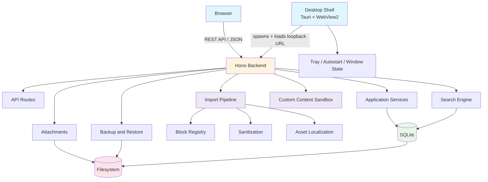

# Architecture

This document describes the architectural approach for RTWiki. It defines the modular monolith structure, the boundaries between layers, the data flow, and the key design principles that guide implementation. It also defines how rich AI-generated content (native blocks, the `rt-*` HTML vocabulary, and sandboxed custom HTML/CSS/JS) flows through the system.

## 1. Architectural Style

RTWiki follows a **simple modular monolith** pattern. There is a single application process that serves both the backend API and the frontend web UI. The application is designed so that, if needed in a future phase, individual modules could be extracted without a complete rewrite. No microservices, no message queues, and no distributed transactions are introduced in the MVP.

## 2. High-Level Component Diagram


```mermaid
graph TD
    B[Browser] -->|REST API / JSON| H[Hono Backend]
    DS[Desktop Shell<br/>Tauri + WebView2] -->|spawns + loads loopback URL| H
    DS --> TR[Tray / Autostart / Window State]
    H --> HR[API Routes]
    H --> AS[Application Services]
    H --> SE[Search Engine]
    H --> AT[Attachments]
    H --> BK[Backup and Restore]
    H --> IP[Import Pipeline]
    IP --> BR[Block Registry]
    IP --> SV[Sanitization]
    IP --> AL[Asset Localization]
    H --> SB[Custom Content Sandbox]
    AS --> DB[(SQLite)]
    SE --> DB
    AT --> FS[(Filesystem)]
    BK --> FS
    DB --> FS
    style B fill:#e1f5fe
    style DS fill:#e1f5fe
    style H fill:#fff3e0
    style DB fill:#e8f5e9
    style FS fill:#fce4ec
    style IP fill:#ede7f6
    style SB fill:#ede7f6
```

## 3. Layer Boundaries

Each layer has a single responsibility and communicates only with its adjacent layers.

### 3.1 Web UI (Frontend)

- **Technology:** React + TypeScript, Vite, Mantine UI, Tabler Icons React
- **Responsibility:** Render the application shell, navigation, and editor. Handle user interactions and display data from the API.
- **Inputs:** REST API responses (JSON).
- **Outputs:** User actions (create, update, delete, search, upload).
- **Constraints:** No server-side rendering. No direct database access. All API calls go through a single typed client module.
- **Version policy:** The React version will be selected and pinned during the implementation phase to be compatible with the selected stable BlockNote, Mantine, and Vite versions. Major versions must never float. Compatibility takes priority over selecting the newest version.

### 3.2 Editor

- **Technology:** BlockNote with `@blocknote/math-block` and `@blocknote/diagram-block`
- **Responsibility:** Provide the block-based editing experience. Manage block state locally and sync to the API via debounced autosave.
- **Scope:** One editor instance per active page. Editor instances are **not** global singletons.
- **Lazy loading:** `@blocknote/math-block` and `@blocknote/diagram-block` are lazy-loaded to reduce initial bundle size.

### 3.3 API Routes

- **Technology:** Hono routes
- **Responsibility:** Expose RESTful endpoints for pages, attachments, search, backups, and imports. Validate all incoming requests using schema validators (e.g., Zod).
- **Endpoints:**
  - `GET /api/pages` — list pages (bounded windows with `limit`/`offset` plus full-count `total`)
  - `POST /api/pages` — create page
  - `GET /api/pages/:id` — get page by ID
  - `PATCH /api/pages/:id` — update page
  - `DELETE /api/pages/:id` — soft-delete page
  - `POST /api/pages/:id/move` — transactional hierarchy move (parent + sibling index) with authoritative reconciliation payload
  - `POST /api/attachments` — upload an image or a document (type decided from the bytes; see [ADR-013](adr/ADR-013-image-attachments.md) and [ADR-015](adr/ADR-015-document-attachments.md))
  - `GET /api/attachments/:id` — serve an image by catalogue id. A **document** is served as a forced download: `Content-Disposition: attachment` plus a per-response `default-src 'none'; sandbox` policy, because a document is a program and inline rendering would execute it in RTWiki's own origin. Images carry no disposition and are drawn by the browser. See [ADR-015](adr/ADR-015-document-attachments.md).
  - `GET /api/attachments/:id/view` — serve a document **inline**, so the browser draws it in a new tab. A separate route, so the download above stays the default and inline is opt-in per request. Same `default-src 'none'; sandbox` policy, applied to this response only. Owner-authorised; see [ADR-016](adr/ADR-016-inline-document-viewing.md), which states the residual same-origin risk.
  - `GET /api/attachments/:id/text` — a document's extracted text, as JSON. Never markup, so document contents can never become a rendering surface.
  - `DELETE /api/attachments/:id` — remove an image or document
  - `GET /api/pages/:id/attachments` — **not implemented.** Attachments are not yet associated with a page, so there is nothing to list per page. Tracked in [KNOWN_BUGS.md](KNOWN_BUGS.md)
  - `GET /api/search?q=...` — full-text search
  - `GET /api/backup` — the three fixed slots, the schedule, and which are due
  - `GET /api/backup/inspect?file=...` — validate one candidate and report date and size, so the confirmation dialog can show them **before** the user commits
  - `PUT /api/backup/settings` — which periods run, and how often
  - `POST /api/backup/run` — take one period's backup now
  - `POST /api/backup/restore` — replace the database from a backup, then stop. **Requires the per-process shutdown token**, the same one and the same constant-time comparison `/api/shutdown` uses, because it is the one request that can destroy a working wiki. The candidate is fully validated first, the current database is moved aside rather than deleted, and the user is told to close and reopen RTWiki — nothing in this codebase respawns the server. See [SECURITY.md](SECURITY.md) §8 and [BACKUP_PLAN.md](BACKUP_PLAN.md).
  - `POST /api/v1/import/pages` — localhost-only import of AI-generated pages / note-packages (documented target; see [ADR-006](adr/ADR-006-rich-content-and-import-contract.md) and [AI Content Import](AI_CONTENT_IMPORT.md))
- **Constraint:** Every route validates inputs. No raw user input reaches the database.

### 3.4 Application Services

- **Responsibility:** Implement business logic. Services are pure functions or classes that operate on validated data.
- **Examples:**
  - `page-service.ts` — page CRUD, hierarchy, links, and the single search-row computation point
  - `attachment-routes.ts` / `attachment-repository.ts` — upload, validation, storage, and retrieval
  - `backup-service.ts` — archive creation and restoration with integrity checks
  - `shared/import/conversion.ts` — the conversion boundary between an import source and editable content

  **None of the `*Service` class names below are real.** `PageService`, `AttachmentService`, `BackupService`, `ImportService` and `SearchService` do not exist in `src/`: these are modules and exported functions, not classes. `ImportService` in particular must not be read as the pipeline of §3.11 existing — see [ADR-020](adr/ADR-020-search-and-conversion-boundary.md). Search has no service class either: it is a `LIKE` query issued from the pages route over the `search_index` table, composed by `search-extraction.ts` (see §3.6).
- **Constraint:** Services are instantiated once per request or per module, not as hidden globals.

### 3.5 Database Access

- **Technology:** Drizzle ORM with Bun SQLite, versioned migrations
- **Responsibility:** Typed database queries with parameterized statements. Schema migrations are applied automatically at startup if needed.
- **Constraint:** All queries use parameterized placeholders. No string concatenation for SQL. Every table maps to a Drizzle schema.

### 3.6 Search

- **Technology:** an ordinary SQLite table, `search_index`, queried with `LIKE` — **not** FTS5
- **Responsibility:** Hold the readable text derived from each page's own content plus the extracted text of every document that page references, and return matches for `GET /api/pages?q=`.
- **Trigger:** The row is recomputed after every page save, and for every page that referenced an attachment when that attachment is deleted.
- **Constraint:** The row holds derived text only, never raw HTML, Markdown source or JavaScript. It is size-bounded (`SEARCH_INDEX_MAX_CHARS`) and the page's own text is placed first, so a large attachment cannot displace it.

**The unused `search_index_fts` table.** Migration `001` also creates `search_index_fts`, an external-content FTS5 mirror of `search_index`. **It is never written, read or queried, and no triggers maintain it — none exist in the schema.** It is kept in place deliberately; see [DATA_MODEL.md §3.6](DATA_MODEL.md) and [ADR-018](adr/ADR-018-documented-vs-built.md) for why switching to it is its own piece of work rather than a detail of this section.

### 3.7 Attachments

- **Technology:** Image and document bytes stored in the `attachments` table, catalogued by the same row ([ADR-014](adr/ADR-014-blob-stored-image-bytes.md), [ADR-015](adr/ADR-015-document-attachments.md))
- **Modules:** `src/shared/attachments/image-formats.ts` (the accepted-image allowlist, dependency-free and shared by client and server), `src/shared/attachments/document-formats.ts` (the accepted-document allowlist, same shape), `src/server/attachments/image-detect.ts` (image detection and header dimension reading), `src/server/attachments/document-detect.ts` (document identification and text extraction via `officeparser`), `src/server/attachments/content-disposition.ts` (RFC 5987 download filenames), `src/server/attachments/attachment-repository.ts` (catalogue and blob streaming), `src/server/attachments/attachment-routes.ts` (endpoints)
- **Endpoints:**
  - `POST /api/attachments` — upload an image or a document; type decided from the bytes, size capped by `bodyLimit` before the body is parsed, pixel count capped from the header
  - `GET /api/attachments/:id` — streams the stored bytes at the type recorded from them, with `X-Content-Type-Options: nosniff` and a `content-length` taken from the stored size. A **document** additionally gets `Content-Disposition: attachment` and a per-response `default-src 'none'` policy, so it downloads rather than rendering in the application's origin ([ADR-015](adr/ADR-015-document-attachments.md))
  - `GET /api/attachments/:id/text` — the text extracted from a document, for a search preview
  - `DELETE /api/attachments/:id` — removes the bytes and their metadata in one statement
  - A refused upload answers with a reason code (`unsupported_type`, `svg_not_supported`, `too_many_pixels`) beside the user-facing message, so the client can give actionable words without parsing English
- **Responsibility:** Accept image uploads, decide the type from content, store under a server-generated name, and serve them back by catalogue id.
- **Constraint:** Uploaded files are never executed. SVG is not accepted, because serving it inline is document execution, and a refused SVG says so. A document is never served inline at all: it is offered as a download behind a per-response `default-src 'none'` policy, so neither the disposition nor the policy alone is the guard. Requests address an attachment by id, and the bytes live in the database, so no user-supplied string reaches the filesystem at all. See [ADR-013](adr/ADR-013-image-attachments.md), [ADR-014](adr/ADR-014-blob-stored-image-bytes.md) and [ADR-015](adr/ADR-015-document-attachments.md).
- **Client:** BlockNote's `uploadFile` hook is the single entry point, so the file picker, paste and drop all take this one path. The image block stores the returned URL, keeping the document canonical BlockNote JSON with no bytes inlined.

### 3.8 Backup and Restore

- **Technology:** ZIP archive containing a consistent snapshot of the SQLite database, taken with `VACUUM INTO` ([ADR-014](adr/ADR-014-blob-stored-image-bytes.md)). Image bytes are in that snapshot, so there is no second thing to keep consistent with it
- **Responsibility:**
  - **Create:** Lock the database, copy files into a ZIP archive, write metadata JSON. Logs are excluded.
  - **Restore:** Validate the archive (checksum or internal manifest), verify it was created by a compatible version, extract to a temporary location, run integrity checks, then replace the live data.
- **Constraint:** Restore is rejected if the archive is corrupted, tampered with, or from an incompatible version.

### 3.9 Shared Schemas and Types

- **Responsibility:** Single source of truth for all shared TypeScript types and runtime schemas (e.g., Zod schemas for validation). Both frontend and backend import from the same module.
- **Examples:** `Page`, `Block`, `Tag`, `Attachment`, `SearchResult`, `BackupMetadata`, `ImportManifest`

### 3.10 Configuration

- **Responsibility:** Central typed configuration object loaded once at startup. The executable directory is resolved once and all paths are derived from it. No environment-variable override exists for the data directory.
- **Provisional defaults** (defined once, may be adjusted after MVP usability testing):
  - Autosave debounce: `2000 ms`
  - Maximum attachment size: `50 MB`
  - Maximum import package size: `50 MB` (ZIP-bomb guard)
  - Custom content (CSS/JS) enabled: `false` (active content off by default)
- **Constraint:** No hardcoded ports, paths, limits, colours, or environment-specific values scattered across modules. All values are read from the config object.
- **Example:** `config.server.port`, `config.data.directory`, `config.attachments.maxFileSize`, `config.import.maxPackageBytes`, `config.customContent.enabled`

### 3.11 Import Pipeline

All content entry paths — **paste, file drop, file import, and the localhost import API** — share one centralized import pipeline. No parallel import implementations are permitted. The pipeline stages are:

```
adapter → validation → sanitize → asset localization → convert → preview → canonical JSON → transactional save
```

- **Adapter:** detects the source format (note-package, HTML, Markdown, or BlockNote JSON) and normalizes it.
- **Validation:** verifies manifests, sizes, and schema versions; applies ZIP-bomb and path-traversal guards for packages.
- **Sanitize:** runs DOMPurify on any HTML; strips scripts from pasted/imported HTML.
- **Asset localization:** downloads/extracts referenced images and stores them as attachment rows, rewriting references.
- **Convert:** maps source structures to the RTWiki-extended BlockNote schema (native blocks + `rt-*` HTML where needed).
- **Preview:** renders a sanitized preview and collects warnings (unknown blocks, stripped scripts).
- **Canonical JSON:** produces the stored BlockNote JSON document.
- **Transactional save:** writes pages and assets inside a single transaction; on failure, rolls back so existing data is untouched.

See [AI Content Import](AI_CONTENT_IMPORT.md) for the full contract and [ADR-006](adr/ADR-006-rich-content-and-import-contract.md) for the rationale.

### 3.12 Block Registry and Composition Root

RTWiki uses a **modular block architecture**. Each rich block type is owned by its own module that declares:

- a unique **type id**,
- a **schema** (Zod/BlockNote schema),
- an **editor** component,
- a **viewer/renderer** component,
- a **parser** (source → block) and **serializer** (block → source),
- optional **viewer-only fallback** for unknown blocks.

All block modules register themselves in a **block registry**. A single **composition root** reads the registries and wires the editor, renderer, import pipeline, and search extractor together. There is **no central switch statement** over block types; behaviour is discovered through registry metadata. The same registry pattern applies to import adapters, export adapters, sanitization policies, asset storage, theme/token providers, package validators, and the schema migrator. A future AI-provider adapter would also register here rather than being hard-wired. See [DEVELOPMENT_STANDARDS.md](DEVELOPMENT_STANDARDS.md) for the enforceable module rules and [ADR-006](adr/ADR-006-rich-content-and-import-contract.md).

### 3.13 Workspace Tree (Sidebar Page Hierarchy)

The sidebar renders pages as an accessible WAI-ARIA tree (`role="tree"` /
`role="treeitem"`, `aria-level`, `aria-expanded`, `aria-selected`) backed by the
adjacency-list data model (see [ADR-008](adr/ADR-008-page-hierarchy-and-workspace-tree.md)).

Responsibilities are split cleanly:

- **Controller (`use-pages-controller`):** owns page state; loads the
  *complete* living-page collection through bounded windows of the paginated
  list endpoint before any hierarchy work — sibling indexes are absolute
  ordinals and a truncated most-recent window would place rows incorrectly.
  Applies optimistic arrangements for moves and replaces them with the server's
  authoritative reconciliation payload; content autosave/PATCH behavior is
  unchanged by hierarchy operations.
- **Tree hook (`use-page-tree`):** owns keyboard exploration only — roving
  tabindex focus (`focusedId`), expansion state, Enter-to-open. Keyboard focus
  is independent of active-page selection: the open page stays selected with
  its editor mounted while other rows are explored.
- **DnD (page tree):** provided by **Wunderbaum itself**, not by a separate
  library. Rows are draggable sources and the tree container is the drop target
  that resolves the hovered row and edge; the hover hint is cached and committed
  at drop, with a drop-time recomputation fallback for sparse drag event streams.
  No hitbox or auto-scroll layer exists — targets scroll into view before drops
  instead.
  - **Corrected 2026-09-29.** This entry previously named
    `@atlaskit/pragmatic-drag-and-drop@3.0.0`. **That package is not in
    `package.json` and never was** — the dependency list has no `@atlaskit/*`
    entry at all. The claim read as an architectural decision and was wrong, which
    is worse than an omission: it would have sent the next reader looking for a
    module that does not exist. Verified against `package.json` and
    `node_modules`, not inferred.
- **DnD (Diagram page blocks):** `Reorder` from **`motion/react`**, already a
  dependency and already used by the tab strip. `Reorder.Group` is given
  `axis="xy"` because the block list is a **wrapping** flex row (`flex-flow: row
  wrap`), and a single axis cannot express "put this diagram to the left of that
  one on the next row". The installed types confirm the value exists
  (`ReorderAxis = "x" | "y" | "xy"`).
  - Dragging starts from a **dedicated grip**, not from the card: the card also
    holds a corner resize handle, a pannable Mermaid canvas and a row of action
    buttons, and a card-wide drag listener would fight all three.
  - A drop calls the **same** `reorderByIds` path as the up/down buttons, so a
    drag and a button press cannot diverge.
  - The up/down buttons are **kept**. A drag needs a pointer; the buttons are
    focusable, labelled and reachable by Tab, and they are the screen-reader
    route.
  - Verified against variable-size cards, wrapped and single-column layouts, and
    resize-then-drag ordering, in `tests/browser/diagram-reorder.pwspec.ts`.
- **Row component:** renders indent level, expand/collapse, drop-hint
  indicators, rename, and the context-menu move alternative ("Move to…",
  Move up/Move down) that shares the same validated move endpoint as DnD.

### 3.14 Custom Content Sandbox (L3)

When a page supplies optional custom HTML/CSS/JS, it is rendered only inside an isolated sandbox (iframe) with `sandbox` attributes that deny same-origin access, disable forms/scripts where unsafe, and block all network egress. The sandbox has no access to the application's database, filesystem, or parent DOM. Active content (scripts) is **off by default** and toggleable per setting. See [ADR-007](adr/ADR-007-sandboxed-custom-content.md) and [SECURITY.md](SECURITY.md).

### 3.15 Logging

- **Responsibility:** Structured logging (JSON lines) for errors, warnings, and operational events. Log entries must never contain sensitive page content.
- **Constraint:** No secrets, no user-provided page content, and no attachment data in logs. Log files use rotation and retention limits so they cannot grow indefinitely.

## 4. Canonical Data Format

### Markdown pages

A Markdown page is rendered by one pure function in
`src/web/features/markdown/markdown-render.ts`: **micromark** (composed with
`micromark-extension-gfm`) → **DOMPurify** → injected as HTML. Raw HTML in Markdown is escaped by the
parser, so it is inert at the source rather than relying on the sanitiser alone. The sanitiser profile
includes MathML and SVG so that maths and diagrams survive it; the constraints that places on diagram
source are recorded in [ADR-017](adr/ADR-017-markdown-engine-micromark.md).

The heading outline for the right-hand panel is built from the same grammar via
`mdast-util-from-markdown` (`markdown-outline.ts`), so the outline and the preview agree structurally
about which lines are headings. Navigation is by index, not by heading text.

Maths in a Markdown page are rendered at parse time by **KaTeX**, into the same HTML string the sanitiser
then processes. `$…$` is inline and `$$…$$` on its own line is display. KaTeX's `trust` is pinned to
`false` and `throwOnError` to `false`; see [ADR-017](adr/ADR-017-markdown-engine-micromark.md).

**Two sources are involved, not one**, and the split is deliberate:

- `micromark-extension-math` provides the **`$$` display** construct, the KaTeX renderer (`mathHtml`), and
  the marker-run matching the tokenizer needs.
- RTWiki's own `math-inline-github-rule.ts` provides the **inline `$…$` construct**, because the package
  decides inline maths by marker count and cannot express GitHub's adjacency rule — with it, two dollar
  amounts in a sentence rendered as an equation. See [ADR-017](adr/ADR-017-markdown-engine-micromark.md)
  for the rule, the measured boundary, and the MIT attribution.

So a reader looking for "the maths extension" will find two files, and that is expected.

### Directive containers: `:::columns`

`micromark-extension-directive` is composed into the same single `MARKDOWN_OPTIONS`, and its
serialiser half `directiveHtml` is what RTWiki's own handlers are registered with. Three modules own it:
`markdown-render.ts` registers the handlers at the composition root, `markdown-columns.ts` decides what
they mean as pure `string -> string` functions, and `markdown-columns-scanner.ts` holds the one
top-level-element scanner both the two-pane split and the N-child collection are built on. The drag is
separate again, in `markdown-columns-divider.ts`, because the preview is an `innerHTML` element React
does not own.

**Its stylesheet is a plain `.css`, not a CSS module** — `markdown-columns.css`, bare-imported by the
preview. Two measured reasons, both of which a source read cannot reveal:

- A CSS module **hashes** its class names, and the markup here is a *string* that a hashed name can
  never reach. The emitted `class="rt-cols"` met a shipped `_rtCols_<hash>_21`.
- A bare side-effect import of a `*.module.css` **emits no CSS at all** in this build — measured —
  while a bare import of a plain `.css` does. A `.module.css` bare-imported alongside another module's
  class-map import contributes nothing, silently, with no build error. This file is the only bare
  `.module.css` import in the app; every other bare CSS import is a plain `.css`.

Consequently `:global(...)` must **not** appear in it: that syntax is only understood by the
CSS-modules compiler, so in a plain stylesheet it reaches the browser verbatim and matches nothing.
`tests/markdown-columns-styles.test.ts` runs the real Vite CSS pipeline over the stylesheet the preview
actually imports and fails if any emitted class has no rule in the CSS that ships. A string assertion
cannot catch this: the name *was* in the source, and hashed on the way out.

`:::columns` renders a row of panes with **N−1 draggable** dividers. Two panes is the everyday case
and needs a separator; three or more uses named children:

````markdown
:::columns{left=40}
Left pane.

***

Right pane.
:::
````

````markdown
::::columns
:::column{width=20}
First.
:::
:::column
Second.
:::
:::column
Third, taking what is left.
:::
::::
````

Four properties of this feature are structural rather than incidental, and each is asserted by a test:

- **The `'*'` fallback is what prevents content loss.** The extension *buffers* a container directive's
  body and hands it to the handler as `directive.content`; it is never written to the output. An
  unclaimed `:::` container is therefore **deleted**, not merely unstyled — and an unclosed fence takes
  the rest of the document with it. Measured, with the extension installed and no fallback:
  `before\n\n:::warning\n**be careful**\n\nafter\n` renders as `<p>before</p>` and loses two paragraphs
  silently. `renderUnknownDirective` writes the name and the content back out, and is the only thing
  standing between a typo'd directive name and silent data loss on an existing note.
- **Children self-render; nothing is handed between handlers.** Nested directives compile *inside out* —
  every `:::column` handler runs before its parent `::::columns`, and its compiled HTML is already in
  the parent's `content`. So the parent finds the children in its own compiled string. Passing them
  through micromark's compile-data store was tried and measured to **lose content**: a `:::column`
  outside any `::::columns` was pushed onto the store, never reached the output, and vanished. Content
  in a row body that is *not* a child is kept in reading order around the row rather than dropped.
- **The width grammar is one integer, not a filter.** `/^\d{1,3}$/` plus a 1–99 range check, because
  `SAFE_FOR_XML` drops any attribute containing `-->` or `]>` **before** the allow-list, so
  `ADD_ATTR` cannot rescue it — `this.encode` does not either, since DOMPurify decodes entities before
  matching — and DOMPurify does not sanitise `style` attribute *contents* at all. A free-form CSS length
  would be copied straight into a live `style` value protected by nothing downstream. A width belongs to
  a **child**, not the root: a root-side list for N panes would need a second grammar. A rejected width
  is **surfaced** with a notice, never silently clamped. See [ADR-017](adr/ADR-017-markdown-engine-micromark.md).
- **The drag reuses the shell's.** `createDividerDrag` was extracted from `PaneDivider`
  (`layout/pane-divider.tsx`) because the behaviour is not React's — only the rendering is. The one
  difference is `unitsPerPixel`: a shell divider is a pixel width and passes `1`, a column divider is a
  percentage of its container and passes `100 / containerWidth`. The `layoutResizing` document flag comes
  from inside the shared object, so a column drag sets it exactly as a shell one does — but **no
  stylesheet reads it.** Measured across every stylesheet in `src/web`: there is not one `transition` on
  a layout property, so the rule the flag exists to enable would suppress nothing. The flag is inert
  pending an owner decision on whether layout-transition suppression is wanted at all.
  One divider resizes the pane to its **left**; the rest of the row absorbs the change, so an N-pane row
  is N independent boundaries rather than one shared budget to rebalance.
- **The divider wiring watches its own invalidation.** All six listeners sit on the preview container,
  which survives every re-render of its contents. But the boundaries they look up hold **element
  references**, and the framework replaces the preview's children wholesale — measured in a browser,
  17 ms after the attach ran, with no React dependency changed and the HTML byte-identical. A snapshot
  therefore goes stale silently: the listener still fires, still gets the right event, still does not
  throw, and every lookup misses. `attachColumnDividers` rebuilds the list from a `MutationObserver` on
  the container's `childList`, so the list cannot outlive the markup it describes. See
  [ADR-017](adr/ADR-017-markdown-engine-micromark.md).

The syntax is `:::name{attr}` with **no spaces** — micromark forbids a space before the name and before
the brace, while Pandoc and Quarto require them, and the two cannot be reconciled without forking the
tokeniser. The failure mode is a **visible literal paragraph** containing the reader's own text, never
silent loss. Nesting requires the outer fence to be **strictly longer** than the inner one; an
equal-length pair leaks the trailing fence as a stray paragraph, which is pinned by a test rather than
left to be discovered.

**The pane separator is a `***` thematic break, not `---`.** A `---` on the line directly after
paragraph text is a *setext heading* in CommonMark: measured, `Left text\n---\nRight text` compiles to
`<h2>Left text</h2>` with no `<hr>` at all, so the divider silently vanishes and both halves land in one
pane. That failure is **not detectable** — the compiled output is the same shape as a heading the author
genuinely meant — so the block reports the fact it *can* observe ("no column separator found") and names
the form that works, rather than asserting a cause it cannot see. The N-child form sidesteps the trap
entirely: it has no separator to get wrong.

**The KaTeX stylesheet is owned by the Markdown workspace**, which imports `katex/dist/katex.min.css`.
`@blocknote/math-block` imports the same file, but only from the Rich Note's lazily-loaded chunk — a
Markdown page never mounts the rich editor, so that CSS was never fetched and maths rendered with a
correct DOM and no glyphs. One stylesheet, one source: the bundler emits a single shared
`katex-*.css` chunk that both paths load. The woff2 files must be present in `build/web` after a build;
a missing font is a silent visual failure, not an error.

BlockNote JSON is the canonical saved representation of page content. HTML and Markdown are import/export formats only — they are converted to and from BlockNote JSON at the API boundary, never stored directly in the database. See [ADR-004](adr/ADR-004-canonical-block-json-format.md) for the full rationale and [ADR-006](adr/ADR-006-rich-content-and-import-contract.md) for the rich-content extension.

The canonical format is a **versioned, RTWiki-extended BlockNote JSON schema**:

- Each `content` document carries a schema `version` so migrations can be applied on startup.
- Rich structures use **typed custom blocks** (cards, tabs, callouts, grids, formulas, diagrams) defined in the block registry.
- When a source (rich HTML/Markdown) cannot be converted losslessly, the original rich-HTML source is stored as a typed `richHtml` block inside `pages.content` so no content is silently lost.
- **Unknown or unrecognized block types are preserved**, not deleted. They are stored and rendered with a safe fallback, and flagged for review.

### Diagram page

The Diagram page is the only dedicated Mermaid page. The Mind Map page was retired: it differed from
this one by a single ternary and two starter strings, and Mermaid's `mindmap` is an ordinary diagram
type offered from the shared template list. See
[ADR-019](adr/ADR-019-one-mermaid-page-and-block.md).

This page type does **not** store BlockNote JSON. Its content is opaque page JSON holding
Mermaid source, never indexed verbatim and never rendered into dashboard previews. The `pages.content`
column is unconstrained TEXT, so changing this format requires **no database migration** — a new
version is a new shape of the same column.

Two versions coexist and both normalise to the same block list, so no caller branches on the version:

- **v1** — `{ version: 1, type, source }`, a single diagram.
- **v2** — `{ version: 2, type, blocks: [{ id, source }] }`, an ordered list, capped at
  `MAX_VISUAL_PAGE_BLOCKS` (50). The cap bounds the autosave payload, the cost of the live previews
  and the work a reorder has to do, and it is enforced on read as well as on write.

A v1 page is not rewritten when it is read. It reads as a one-block page and becomes v2 the first
time it is saved, which is why an old page and a new page can sit in the same database with no
migration step.

A page written as a Mind Map page records `type: "mindmap"` inside its own JSON, independently of the
`pages.page_type` column that migration `010_mindmap_pages_to_diagram` rewrites. That stored value is
accepted on read and normalised to `diagram`, so the migration needs no JSON rewrite in SQL and cannot
fail in a second, separate place.

**Current state:** a Diagram page renders every block it holds, each as its own card with
its own render state. Actions are per block — edit, move up, move down, remove — plus an **Add
diagram** button that appends a starter diagram. A page-level **Refresh** re-renders every block; a
failed block offers **Retry** for itself alone, so one broken diagram no longer replaces the page's
canvas.

Reordering is offered as **Move up / Move down** rather than only as a drag. Both produce the same
order, but buttons are reachable from the keyboard and name themselves to a screen reader, whereas a
drag handle is neither. The order goes through the same shared `reorderByIds` rule the tab strip
uses, so a block can never be dropped or duplicated by a malformed order.

## 5. Lazy Loading

Heavy features are lazy-loaded to keep the initial bundle small:

- `@blocknote/math-block` — loaded only when a formula block is encountered
- `@blocknote/diagram-block` — loaded only when a Mermaid diagram block is encountered
- Custom-content sandbox runtime — loaded only when a page uses L3 custom HTML/CSS/JS
- Any future visual mind-map editor (React Flow) — loaded on demand

## 6. Windows Executable Bundling

Frontend assets (the built `dist/` folder from Vite) are bundled alongside the backend executable in the final Windows artifact. The user downloads and extracts a single `.zip` and runs the `.exe`. Mutable data (`data/`, `logs/`) lives inside the extracted folder beside the executable. The `data/` and `logs/` directories are absent from the fresh ZIP and are created automatically on first launch. See [ADR-005](adr/ADR-005-portable-data-layout.md) for the data layout decision.

### 6.1 Desktop Shell Package (ADR-011)

The desktop distribution adds a thin Tauri shell (`RTWiki.exe`, Rust +
WebView2) that spawns the Bun server as a sidecar (`RTWikiServer.exe`) and
loads the same loopback URL a browser would. The shell owns only native
concerns — window, tray icon, autostart registration, portable window geometry
(`data/window-state.json`), sidecar lifecycle, and startup error dialogs. All
application logic stays in the Hono backend; the frontend reaches native
features through a single guarded bridge module with browser fallbacks, so no
native feature is ever required for the app to function. Browser mode remains
available via the tray menu and `RTWiki.exe --browser`. See
[ADR-011](adr/ADR-011-tauri-desktop-wrapper.md).

## 7. Cross-References

- [ADR-001](adr/ADR-001-browser-first-local-application.md) — browser-first architecture decision
- [ADR-002](adr/ADR-002-bun-hono-sqlite.md) — runtime and database technology decision
- [ADR-003](adr/ADR-003-react-blocknote-mantine.md) — frontend framework decision
- [ADR-004](adr/ADR-004-canonical-block-json-format.md) — canonical format decision
- [ADR-005](adr/ADR-005-portable-data-layout.md) — data directory decision
- [ADR-006](adr/ADR-006-rich-content-and-import-contract.md) — rich-content model and import contract
- [ADR-007](adr/ADR-007-sandboxed-custom-content.md) — sandboxed custom content
- [ADR-008](adr/ADR-008-page-hierarchy-and-workspace-tree.md) — page hierarchy and the workspace tree
- [ADR-011](adr/ADR-011-tauri-desktop-wrapper.md) — desktop shell and sidecar process model
- [DATA_MODEL.md](DATA_MODEL.md) — detailed entity and relationship specification
- [SECURITY.md](SECURITY.md) — security requirements for each layer
- [DEVELOPMENT_STANDARDS.md](DEVELOPMENT_STANDARDS.md) — coding rules that govern implementation
- [AI_CONTENT_IMPORT.md](AI_CONTENT_IMPORT.md) — note-package contract and import pipeline
- [REFERENCE_RESEARCH.md](REFERENCE_RESEARCH.md) — comparable tools and libraries researched

## Workspace tab state ownership

Session document tabs live in `App` (`OpenTab[]` from
`src/web/features/tabs/tabs-model.ts`) and are derived from, but never own,
page data: every selection path funnels through one deduplicating effect keyed
on the controller's `selectedPage`. Tab close/rename/delete reconcile against
the controller and reuse its flush guards; persistence remains exclusively
server-side. The persistent Rich Document toolbar receives the editor instance
from the editor surface and issues commands through BlockNote's public API.
